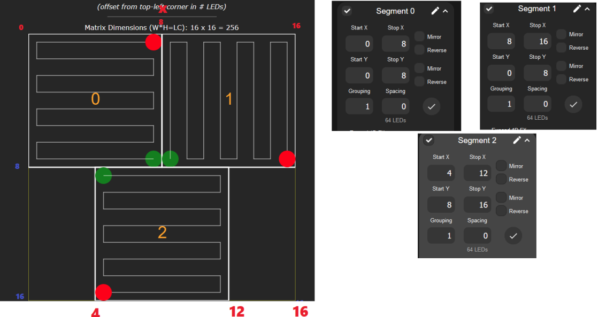
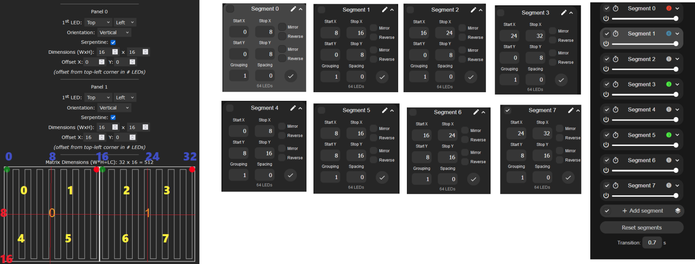

## Overview

HOW TO :  Create segments with  2D setup  ? if you tried to do segments in 2D then it might look  harder then it is  , if you know where is the x and y on the 2d page screen then all become  clear

In this example  of  32x16 ( made of two 16x16 but that does not matter ) we segment the matrix to 8 smaller ones

Peek view

Real leds

