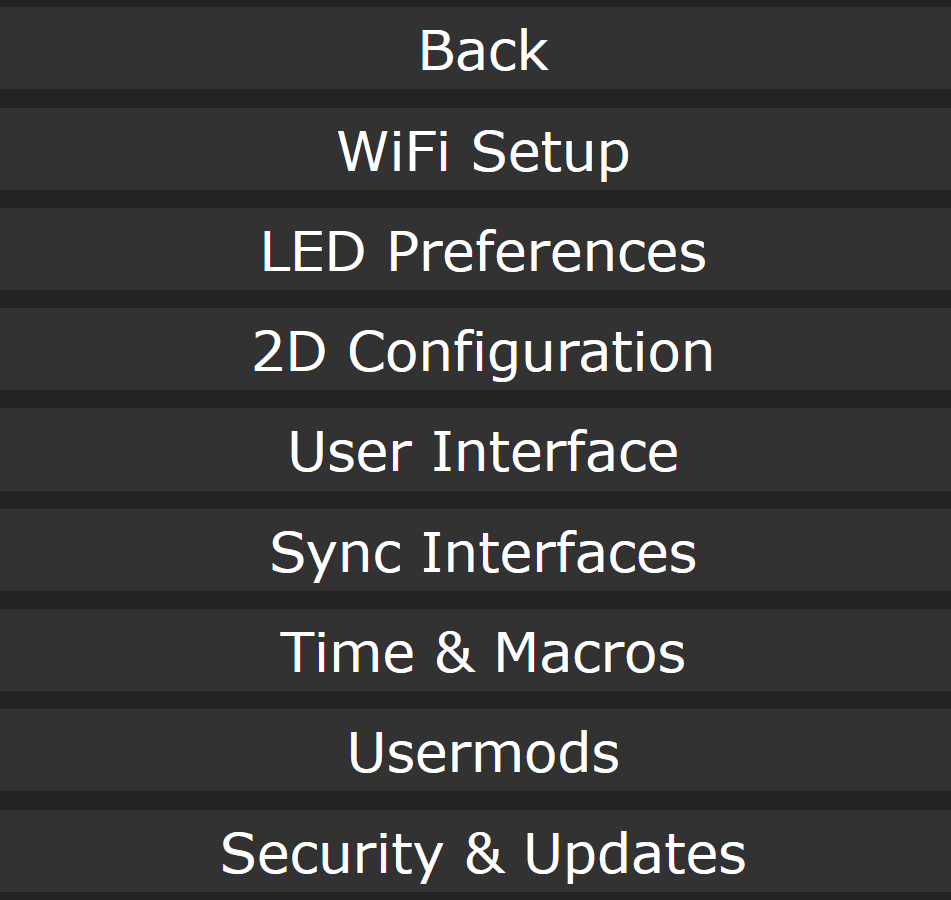
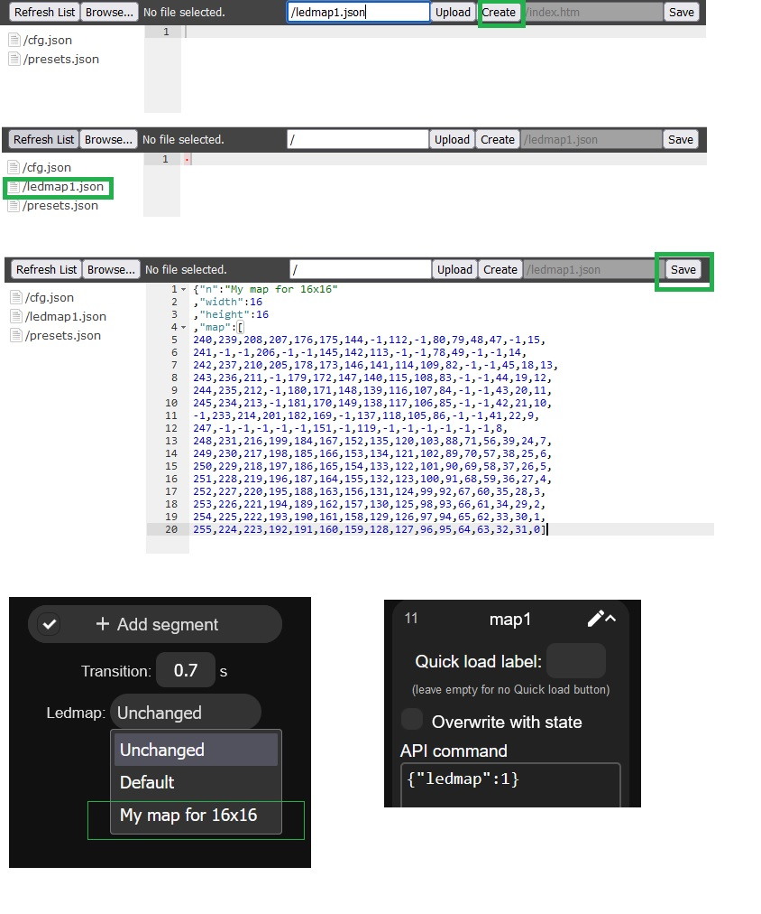

## A) The basics 
A.1) How to configure a matrix in wled 

A.2) How to create a ledmap 

Go to your unit ip address  wled-ip/edit and add a file named ledmap1.json  and reboot wled , you can then select your new map from under the segment or add
it to the api calls using "ledmap":1  ( note: you can use ledmap1.json to  ledmap10.json but more with build flag  -D WLED_MAX_LEDMAPS=X  where X is max of 156 maps )

A.3) How to genrate a ledmap 
If your fixture is wired as a matrix ( led order is not changed ) then you can simpliy use the tool hosted here 
https://dosipod.github.io/WLED-Ledmap-Generator/

If your fixture has odd shape or the order of leds changed and not waired as a matrix then you can use the  sheet and examples  here 
https://github.com/dosipod/WLED-Ledmap-Generator/tree/master/assets/odd_shapes

