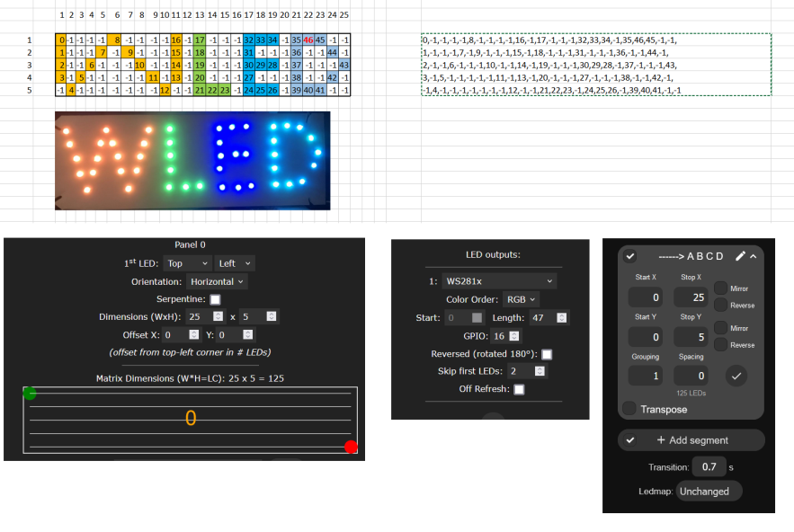
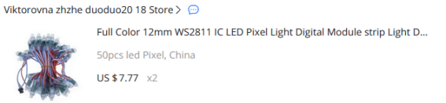
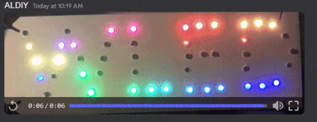

## Overview

Just to demo how easy it is to use ledmaps , this time I  used  those pixels i had and just drilled them in  cardboard because i have no time to solder  ,  all 2D effects would work , text ..etc , i have no space else i would build something bigger 

